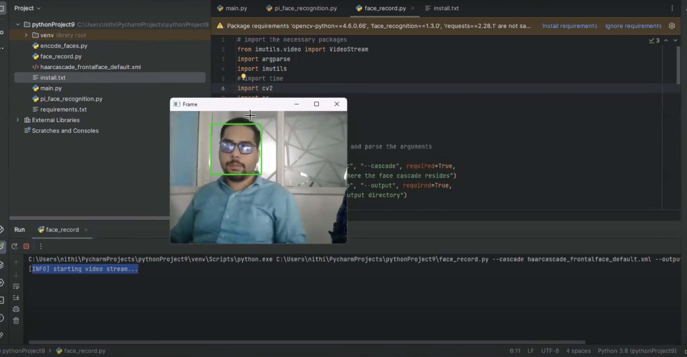
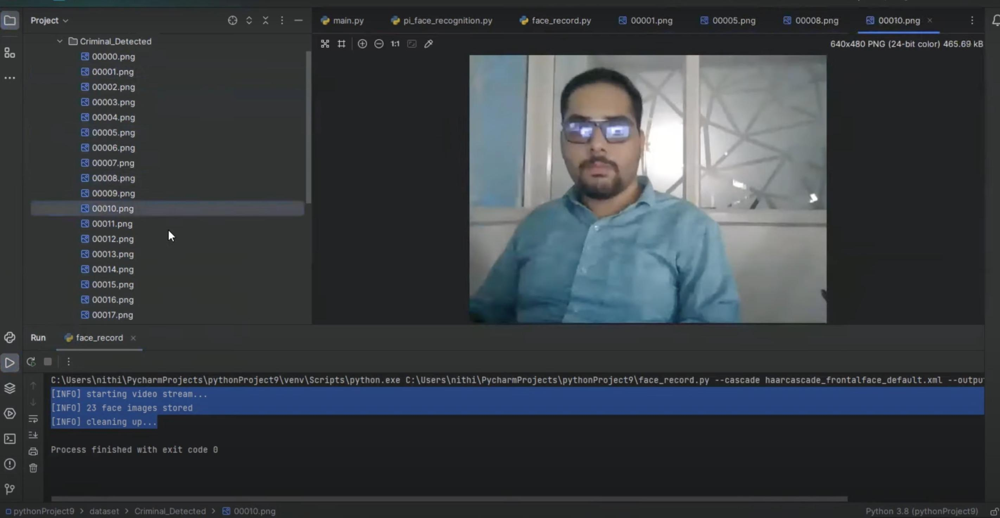
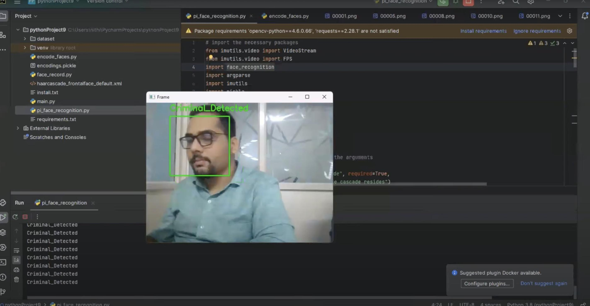

# Criminal-Face-Detection-Using-OpenCV

There is an abnormal increase in the crime rate and also the number of criminals are increasing, this leads towards a great concern about the security issues.
Crime preventions and criminal identification are the primary issues before the police personnel, since property and lives protection are the basic concerns of the police but to combat the crime, the availability of police personnel is limited. With the advent of security technology, cameras especially CCTV have been installed in many public and private areas to provide surveillance activities. 
 
The footage of the CCTV can be used to identify suspects on scene. This Real time criminal identification system based on face recognition works with a fully automated facial recognition system. Haar feature-based cascade classifier and OpenCV LBPH (Local Binary Pattern Histograms) Algorithms are used for Face detection and recognition. This system will be able to detect face and recognize face automatically in real time. An accurate location of the face is still a challenging task. Viola-Jones framework has been widely used by researchers in order to detect the location of faces and objects in a given image. Face detection classifiers are shared by public communities, such as OpenCV.

## ScreenShot

 

## Proposed System

This project is aimed at developing an application called Real-Time criminal identification system based on face recognition. We are able to detect and recognize faces of the criminals in an image and in a video stream obtained from a camera in real time. We have used Haar feature- based cascade classifiers in OpenCV approach for face detection. 
 
It is a machine learning based approach where a cascade function is trained from a lot of positive and negative images. It is then used to detect objects in other images. Also, we have used Local Binary Patterns Histograms (LBPH) for face recognition. This application helps police personnel in many ways. In our application we can register a criminal, once it is successfully done we can track and find criminals using CCTV footage or by manually giving image as input. Data is each criminal is managed through dataset. When a criminal is detected at any time on camera (CCTV) criminal details will be displayed. 
 
In this way a lot of time is saved and this is a highly secure process and one can detect criminals easily. Our application is 95 percent accurate and it is fast, robust, reliable and easy to use.
